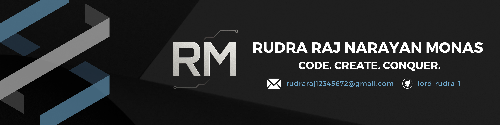

# Hi there, I'm Rudra Raj Narayan Monas 👋

  

  <b>Studying at IIIT Vadodara ICD | Backend Developer | Tech Enthusiast</b>

---

- 🔭 I'm currently working on **Backend Development**
- 👨‍💻 All of my projects are available at [GitHub](https://github.com/lord-rudra-1)
- 🌱 Currently learning new backend technologies
- 💬 Ask me about Python, C++, or backend stuff
- 📫 Reach me at **rudraraj12345672@gmail.com**
- 🔭 [My Devfolio](https://rudra-portfolio-one.vercel.app/)

---

## 🚀 Languages and Tools

  
  
  
  
  
  
  
  
  
  
  
  
  

---

## 📊 GitHub Stats

  

  

  

---

## 🌐 Connect with me

  
  
  
  

