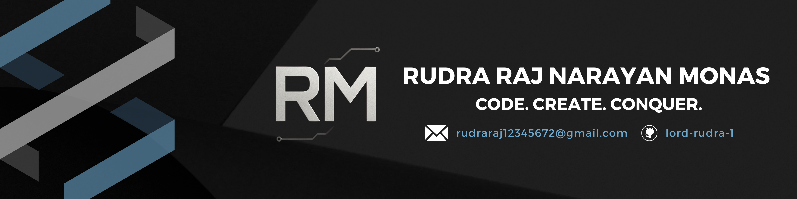

# Hi there, I'm Rudra Raj Narayan Monas 👋

  

  <b>Computer Science Student @ IIIT Vadodara | AI & ML Engineer | Software Developer</b>

  
  
  
  

---

### 🚀 About Me
I'm a passionate **Computer Science and Engineering (B.Tech)** student at **IIIT Vadodara** specializing in **Artificial Intelligence, Machine Learning, and Software Engineering**. I thrive on architecting complex data pipelines, developing state-of-the-art machine learning models, and building scalable software systems that solve real-world technical challenges.

---

### 💼 Experience & Achievements
- 🔬 **SURGE Research Intern @ IIT Kanpur (May 2026 - Present):** Designed a novel zero-shot denoising method for microscopic images targeting Gaussian and Poisson noise, outperforming state-of-the-art models on FMD datasets using PyTorch/CUDA.
- 👨‍🏫 **Teaching Assistant @ IIIT Vadodara (2026 - Present):** Assisting laboratory sessions and conducting tutorials for both **Design and Analysis of Algorithms** and **Data Structures**, helping over 180 students with complex debugging and complexity analysis in C/C++.
- 🚀 **Product Innovation Intern @ InventX Accelerator (May 2025 - Jul 2025):** Designed vibration-damping hardware using signal processing and Fourier Transform analysis.
- 🏆 **Achievements:** 
  - Maintained a **CPI of 8.98/10.0** (Top 5% of the class).
  - Secured **AIR 6271** in GATE 2026 (Computer Science).
  - NPTEL Machine Learning top 5% cohort.

---

### 🛠️ Technical Skills

  
  
  
  
  
  
  
  
  

* **Core CS**: Data Structures & Algorithms, Operating Systems, DBMS, Computer Networks, OOP
* **ML & AI**: Computer Vision, Image Processing, Federated Learning, Deep Learning, Hybrid RAG
* **Tools**: Linux, MATLAB, Streamlit, REST APIs

---

### 🔥 Featured Projects

  
  

  
  

  
  

